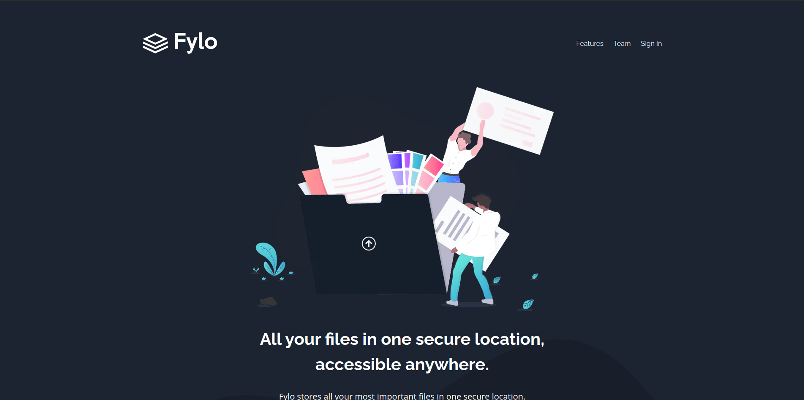

# Frontend Mentor - Fylo dark theme landing page solution

This is a solution to the [Fylo dark theme landing page challenge on Frontend Mentor](https://www.frontendmentor.io/challenges/fylo-dark-theme-landing-page-5ca5f2d21e82137ec91a50fd).
## Table of contents

- [Overview](#overview)
  - [Screenshot](#screenshot)
  - [Links](#links)
- [My process](#my-process)
  - [Built with](#built-with)
- [Author](#author)

## Overview

### Screenshot

### Links

- Solution URL: [https://github.com/markrajk/fm_fylo_dark_theme_landing_page](https://github.com/markrajk/fm_fylo_dark_theme_landing_page)
- Live Site URL: [https://fm-fylo-dark-theme-landing-page-jet.vercel.app/](https://fm-fylo-dark-theme-landing-page-jet.vercel.app/)

## My process

### Built with

- Semantic HTML5 markup
- Mobile-first workflow
- [Next.js](https://nextjs.org/) - React framework
- [Styled Components](https://styled-components.com/) - For styles

## Author

- Website - [wwww.web-apprentice.com/](https://www.web-apprentice.com/)
- Frontend Mentor - [@markrajk](https://www.frontendmentor.io/profile/markrajk)